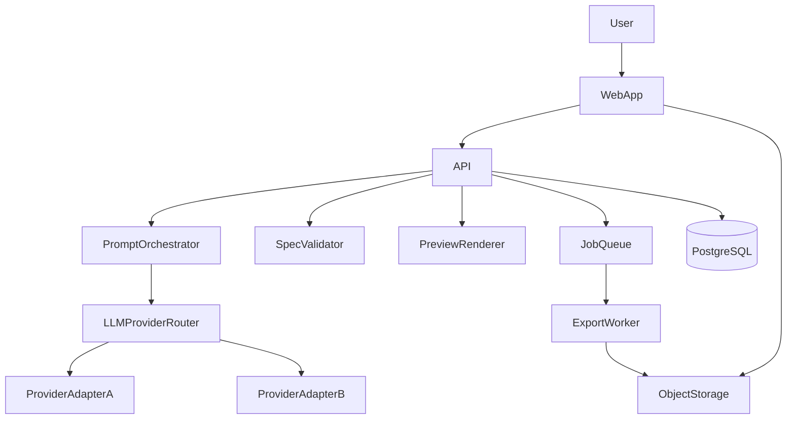
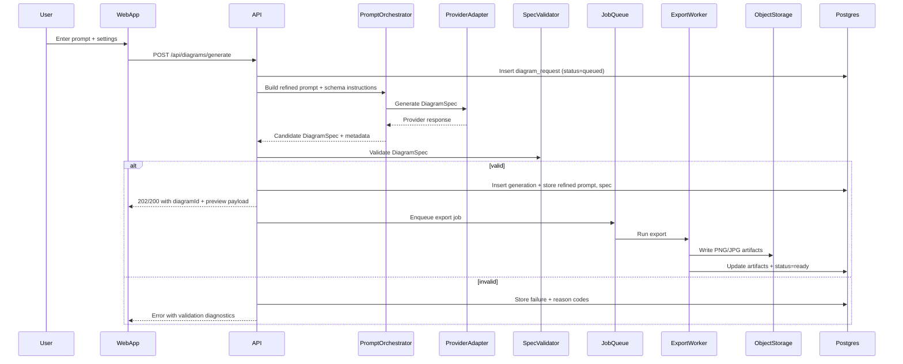

# Technical Architecture (V1)

## Summary
V1 is a managed-cloud-first web app + API that turns a user prompt into a validated `DiagramSpec`, renders an interactive HTML preview, exports PNG/JPG, stores prompts and artifacts, and supports multiple LLM providers behind an abstraction layer (enable 1–2 initially).

## Key design decisions
- **Rendering contract**: LLM outputs `DiagramSpec` (JSON) validated by schema; system renders deterministically.
- **Provider abstraction**: adapters for OpenAI/Anthropic/etc. behind a single interface.
- **Async export**: image rendering happens out-of-band (job queue/worker) to keep API responsive.
- **Untrusted output handling**: treat provider output as untrusted; validate before any render.

## Component diagram

## Sequence (generate -> preview -> export)

## API responsibilities
- Authenticate user (MVP+ if public).
- Create and track `diagram_request` state machine.
- Orchestrate provider calls and retries (with timeouts).
- Validate spec and reject unsafe/unsupported output.
- Provide preview payload and artifact URLs.
- Enqueue and monitor export jobs.

## Provider abstraction
### Interface (conceptual)
- `generateDiagramSpec(request): ProviderResult`
  - inputs: refined prompt, schema, examples, constraints
  - outputs: spec, rawResponse, usage/cost, providerLatency, modelId

### Routing (V1)
- Default provider (configured).
- Optional explicit provider selection in request (internal/admin).
- Fallback on transient errors (e.g., switch to provider #2).

## Validation & safety
Minimum checks:
- JSON Schema validation for `DiagramSpec`
- caps on primitives, text length, canvas size
- denylist unexpected fields
- strict type checking on numeric ranges

## Rendering & export
### Preview
Render `DiagramSpec` to SVG/Canvas in the browser using our renderer library.

### Export
Two viable approaches (choose one in implementation):
- **Headless browser**: render the same preview HTML in headless Chromium and screenshot.
- **SVG rasterization**: render SVG and rasterize to PNG/JPG server-side.

V1 recommendation: headless browser for parity, then optimize later if needed.

## Data + storage
- **PostgreSQL** for requests, generations, artifacts, audit events.
- **Object storage (S3-compatible)** for PNG/JPG (and optionally HTML bundles).
- Use signed URLs for downloads when appropriate.

## Observability
Minimum signals:
- requestId/diagramId trace fields on all logs
- provider latency, validation outcome, export latency
- error categorization: provider_error / validation_error / export_error

## Deployment (managed cloud-first)
- One web+api service (monolith) is acceptable for V1.
- One worker service for export jobs.
- Managed Postgres and S3 bucket.
- Secrets via managed secret store; per-provider API keys scoped by environment.

