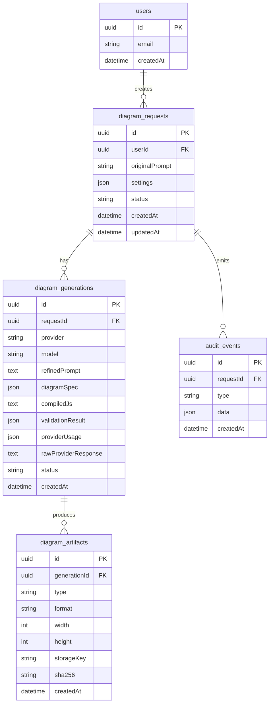

# Data Model (V1)

## Overview
We store three categories of data:
- **Requests and generations** (prompts, provider calls, validation outcomes)
- **Artifacts** (HTML preview payload reference, PNG/JPG files)
- **Audit trail** (events across the pipeline)

## ERD (conceptual)

## Table-level details (proposed)
### `users`
- **id**: uuid (pk)
- **email**: unique (nullable if anonymous mode later)
- **created_at**

Indexes:
- unique(email)

### `diagram_requests`
- **id**: uuid (pk)
- **user_id**: fk -> users.id (nullable if anonymous v1)
- **original_prompt**: text
- **settings**: jsonb (width/height/theme/background/format)
- **status**: enum-like text (`queued|generating|validating|rendering|exporting|ready|failed`)
- **created_at**, **updated_at**

Indexes:
- (user_id, created_at desc)
- (status, updated_at desc) for operational queries

### `diagram_generations`
One request can produce multiple generations (retries, provider fallback, “regenerate”).

Fields:
- **id**: uuid (pk)
- **request_id**: fk -> diagram_requests.id
- **provider**: text
- **model**: text
- **refined_prompt**: text
- **diagram_spec**: jsonb (validated spec; include `specVersion`)
- **compiled_js**: text (optional; compiled from spec to satisfy “store JS code” requirement)
- **validation_result**: jsonb (pass/fail + reason codes)
- **provider_usage**: jsonb (tokens/cost/latency if available)
- **raw_provider_response**: text or jsonb (consider redaction policy)
- **status**: `succeeded|failed`
- **created_at**

Indexes:
- (request_id, created_at desc)
- (provider, model, created_at desc)

### `diagram_artifacts`
Artifacts produced from a generation.

Fields:
- **id**: uuid (pk)
- **generation_id**: fk -> diagram_generations.id
- **type**: `preview_html|image`
- **format**: `html|png|jpg`
- **width**, **height**
- **storage_key**: text (S3 key)
- **sha256**: text (dedup / integrity)
- **created_at**

Indexes:
- (generation_id, type, format)
- unique(storage_key)
- (sha256) optional for dedup

### `audit_events`
Append-only events for traceability and debugging.

Fields:
- **id**: uuid (pk)
- **request_id**: fk -> diagram_requests.id
- **type**: e.g. `request_created|provider_called|validation_failed|export_succeeded|downloaded`
- **data**: jsonb (free-form details, sanitized)
- **created_at**

Indexes:
- (request_id, created_at)
- (type, created_at desc)

## Retention and redaction
Policy decisions to implement early:
- Whether to store full raw provider responses or a redacted version.
- Retention window for raw responses and audit events (cost and privacy).

