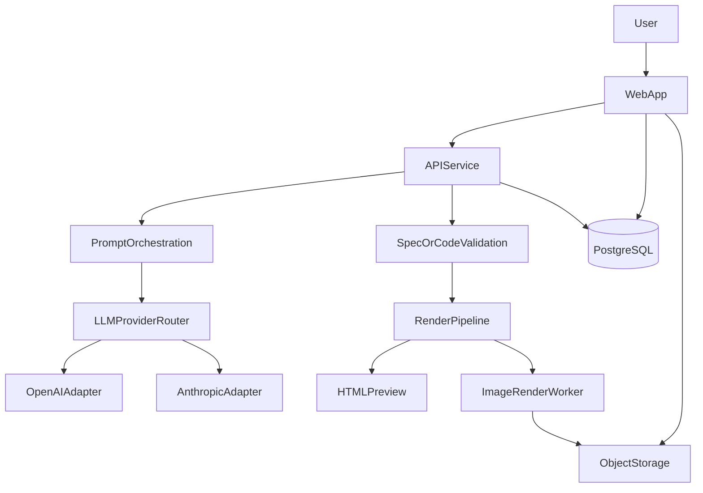

# AI Diagram Generator Plan

## Product Goal
Build a web application and public/internal API where a user describes a diagram in natural language, the system uses an LLM provider to generate JavaScript rendering code, returns an HTML preview, renders an exportable PNG/JPG image, and stores both the generation prompt history and the resulting code for audit and reuse.

## V1 Product Spec
### Primary user flow
1. User enters a natural-language prompt describing a desired diagram.
2. Backend refines the prompt into a structured generation request.
3. System calls an abstracted AI provider layer, initially enabling 1-2 providers.
4. Provider returns rendering code targeting a standard client-side diagram runtime.
5. Backend validates/sanitizes the generated code and stores:
   - original user prompt
   - refined/system prompt used for generation
   - generated JavaScript code
   - provider metadata and status
6. Web app displays a rendered HTML preview.
7. System renders a static image version (`png`, optional `jpg`) for view/download.
8. User can revisit prior generations.

### V1 scope boundaries
Include:
- General-purpose diagrams, but constrained by a supported rendering contract.
- Web UI plus API from the start.
- Provider abstraction layer with only 1-2 providers enabled initially.
- Managed-cloud-friendly architecture.
- Persistent storage of prompts, generated code, and outputs.

Exclude from initial release:
- Arbitrary unbounded JS execution from providers.
- Full collaborative editing.
- Fine-grained version control for diagrams.
- Large-scale marketplace/template features.
- Broad local-LLM support in v1, though the abstraction should allow it later.

## Recommended Technical Direction
### Rendering strategy
For v1, prefer a controlled rendering contract over raw arbitrary D3/C3 generation.

Recommended approach:
- Ask the LLM to emit a constrained JSON-based scene spec or a small DSL first.
- Compile that spec into deterministic renderer code on the server/client.
- Allow an escape hatch later for trusted "advanced JS renderer" mode.

Reasoning:
- Much safer than executing arbitrary AI-generated JavaScript.
- Easier to validate, test, cache, and render to image.
- Better compatibility across preview and export.

If you still want direct JS generation, enforce:
- sandboxed execution
- strict allowlist of libraries/APIs
- code lint/AST validation
- timeouts and resource limits

### Suggested stack
- Frontend: `Next.js` web app for prompt entry, preview, history, and downloads.
- Backend/API: `Next.js API routes` or a separate `Node.js` service if you want cleaner scaling boundaries.
- Database: `PostgreSQL`.
- ORM: `Prisma`.
- Object storage: `S3`-compatible bucket for rendered images and optional HTML artifacts.
- Queue/workers: background jobs for image rendering and retries.
- Rendering engine:
  - HTML preview in browser using a controlled renderer.
  - PNG/JPG export via headless Chromium (`Playwright`/`Puppeteer`) or server-side SVG-to-image pipeline depending on renderer choice.
- AI providers initially: `OpenAI` and `Anthropic`, behind a provider adapter interface.

## High-Level Architecture

## Core Domain Model
Key entities to define early:
- `users`
- `diagram_requests`
  - original prompt
  - normalized prompt
  - requested output type
  - status
- `diagram_generations`
  - provider
  - model
  - refined prompt
  - raw provider response
  - generated spec/code
  - validation result
- `diagram_artifacts`
  - html artifact reference
  - png/jpg artifact reference
  - dimensions
  - checksum/version
- `audit_events`
  - generation requested
  - validation failed
  - render completed
  - download requested

## API Surface (Initial)
Suggested endpoints:
- `POST /api/diagrams/generate`
- `GET /api/diagrams/:id`
- `GET /api/diagrams/:id/html`
- `GET /api/diagrams/:id/image`
- `GET /api/diagrams/history`
- `POST /api/providers/test` (internal/admin only)

Example generation contract:
- input: user prompt, optional diagram type hint, optional provider choice
- output: diagram id, status, preview payload, artifact URLs when ready

## Engineering Lifecycle
### Phase 0: Discovery and product spec
Produce:
- product requirements document
- supported diagram taxonomy for v1
- success metrics
- non-functional requirements
- security constraints around generated code/spec execution

Questions to settle in this phase:
- Will v1 generate raw JavaScript, or a validated intermediate spec compiled into JS?
- What diagram classes are explicitly supported versus best effort?
- What latency target is acceptable for preview and for image export?

### Phase 1: Architecture and threat model
Design:
- provider abstraction interface
- generation pipeline states
- validation strategy
- rendering sandbox model
- persistence schema
- async job architecture for image exports

Critical outputs:
- sequence diagrams
- data model
- API contracts
- security review of AI-generated output handling

### Phase 2: Prototype
Build a thin slice proving the risky path:
- prompt input UI
- `POST /generate`
- one provider enabled
- one renderer path
- HTML preview
- PNG export
- persistence of prompts and generated output

Goal:
- validate quality, latency, rendering reliability, and export correctness before broad feature work.

### Phase 3: MVP
Add:
- second provider
- provider selection/fallback rules
- generation history
- download UX
- retries and error handling
- observability and admin diagnostics
- auth if multi-user/public

### Phase 4: Production hardening
Add:
- quotas/rate limits
- caching/deduplication
- test coverage for generation pipeline
- sandbox hardening
- CI/CD
- cost controls and provider monitoring

## Security and Risk Areas
Highest-risk engineering concern is executing or rendering AI-generated output safely.

Mitigations:
- Prefer spec/DSL over arbitrary JavaScript.
- Validate generated payloads with schema checks.
- If JS is allowed, parse AST and reject dangerous constructs.
- Render in isolated sandbox/container with no network access.
- Enforce timeouts, memory limits, and output-size caps.
- Store provider prompts/responses carefully with redaction rules where needed.

## Testing Strategy
### Must-have tests
- provider adapter contract tests
- prompt orchestration tests
- schema/code validation tests
- renderer snapshot tests for known prompts
- export pipeline tests for PNG/JPG generation
- end-to-end test for generate -> preview -> download

### Evaluation strategy
Create a fixed prompt suite covering:
- geometric diagrams
- labeled educational visuals
- chart-like diagrams
- edge cases with malformed or ambiguous prompts

Track:
- generation success rate
- render success rate
- export success rate
- median latency
- human-rated diagram accuracy

## Suggested Delivery Sequence
1. Write the PRD and technical spec.
2. Decide whether v1 uses `JSON/DSL -> renderer` or direct JS generation.
3. Define the provider adapter interface.
4. Design the DB schema and artifact storage model.
5. Implement a thin vertical prototype.
6. Add image export worker and artifact downloads.
7. Add history, observability, and production safeguards.

## First Documents To Produce
Start with these artifacts in order:
- `Product Requirements Document`
- `Technical Design Doc`
- `API Specification`
- `Data Model / ERD`
- `Threat Model`
- `Prototype Milestone Plan`

## Recommendation
My strongest recommendation is to treat LLM output as a structured diagram specification, not directly as executable JavaScript, even if your user-facing story says the system "generates JS." Internally, you can still compile the validated spec into D3/Canvas/SVG/other rendering code and store that generated code alongside the refined prompt as required.

